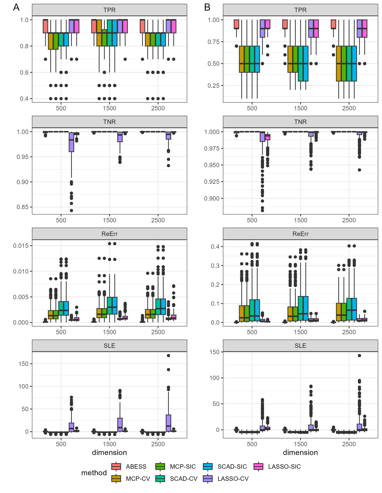

# Reproducible materials
This repository contains scripts to run the simulation described in [A Polynomial Algorithm for Best-Subset Selection Problem](https://www.pnas.org/doi/10.1073/pnas.2014241117). 

## Codes

1. `simulation.R`: This script produce the simulation result in the paper with format ".rda"
2. `visualize.R`: generate the Figures 1 and 2 in the main text.
3. `tablize.R`: create the Table 1 (in the main text) and Tables S1-S3 (in the support information).

## Softwares

* abess : R package `abess` (0.4.6).
* Lasso : R package `glmnet` (4.1.6).
* MCP & SCAD : R package `ncvreg` (3.13.0).

## Visualization
### Low-dimensional results
We get the low-dimensional results:
<div align=center>

</div>
### High-dimensional results
We get the high-dimensional results:
<div align=center>

</div>
The runtime comparison results are presented as
<div align=center>

</div>

## Citations

Please cite the following publications if you make use of the material here.

- Junxian Zhu, Canhong Wen, Jin Zhu, Heping Zhang, and Xueqin Wang (2020). A polynomial algorithm for best-subset selection problem. Proceedings of the National Academy of Sciences, 117(52):33117-33123.

- Jin Zhu, Xueqin Wang, Liyuan Hu, Junhao Huang, Kangkang Jiang, Yanhang Zhang, Shiyun Lin and Junxian Zhu (2022). abess: A Fast Best-Subset Selection Library in Python and R. Journal of Machine Learning Research, 23(202), 1-7.

The corresponding BibteX entries:

```
@article{doi:10.1073/pnas.2014241117,
  author = {Junxian Zhu and Canhong Wen and Jin Zhu and Heping Zhang and Xueqin Wang},
  title = {A polynomial algorithm for best-subset selection problem},
  journal = {Proceedings of the National Academy of Sciences},
  volume = {117},
  number = {52},
  pages = {33117-33123},
  year = {2020},
  doi = {10.1073/pnas.2014241117},
  URL = {https://www.pnas.org/doi/abs/10.1073/pnas.2014241117}
}

```
and
```
@article{JMLR:v23:21-1060,
  author  = {Jin Zhu and Xueqin Wang and Liyuan Hu and Junhao Huang and Kangkang Jiang and Yanhang Zhang and Shiyun Lin and Junxian Zhu},
  title   = {abess: A Fast Best-Subset Selection Library in Python and R},
  journal = {Journal of Machine Learning Research},
  year    = {2022},
  volume  = {23},
  number  = {202},
  pages   = {1--7},
  url     = {http://jmlr.org/papers/v23/21-1060.html}
}
```


## Contact
Please direct questions and comments to the [issues page](https://github.com/abess-team/A-Polynomial-Algorithm-for-Best-Subset-Selection-Problem/issues).
